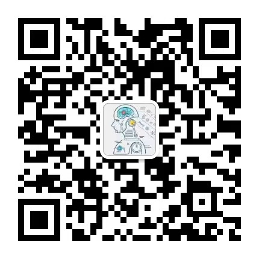

模型都未进行调参，未能使模型的准确率达到最高
# 项目名称：
使用 Bi-LSTM-CRF 模型来对进行实体识别

# 项目环境：
pytorch、python   
相关库安装
```
pip install -r requirement.txt
```

# 项目目录：
```
Bi-LSTM-CRF  
    |-- data                 数据集   
    |-- img                  存放模型相关图片            
    |-- model                保存的模型               
    |-- config.py            配置文件                              
    |-- main.py              主函数                      
    |-- model.py             模型文件                     
    |-- predict.py           预测文件                         
    |-- requirement.txt      需要的安装包
    |-- utils.py             数据处理文件
```

# 项目介绍：
本项目中使用了三个版本来学习使用 Bi-LSTM+CRF                      
版本一 是 pytorch 库中的 torchcrf 来学习使用，具体内容在此：[TorchCRF库基本使用](./版本一/TorchCRF库基本使用.md)                        
版本二 是直接从数学逻辑中直接编写 CRF 模块

# 项目数据集
数据集用的是论文[【ACL 2018Chinese NER using Lattice LSTM】](https://github.com/jiesutd/LatticeLSTM)中从新浪财经收集的简历数据。

# 模型训练
`python main.py`

# 模型预测
`python predict.py`

# 博客地址
[CSDN Bi-LSTM-CRF 实体识别](https://blog.csdn.net/qq_48764574/article/details/131609636)

[知乎 Bi-LSTM-CRF 实体识别](https://zhuanlan.zhihu.com/p/645620277)

# 微信交流群
我们有一个微信交流群，大家如果有需要，可以加入我们，一起进行学习。关注公众号后会有一个私人微信，添加微信，备注进群，就可以拉你进群，进行学习。

   
